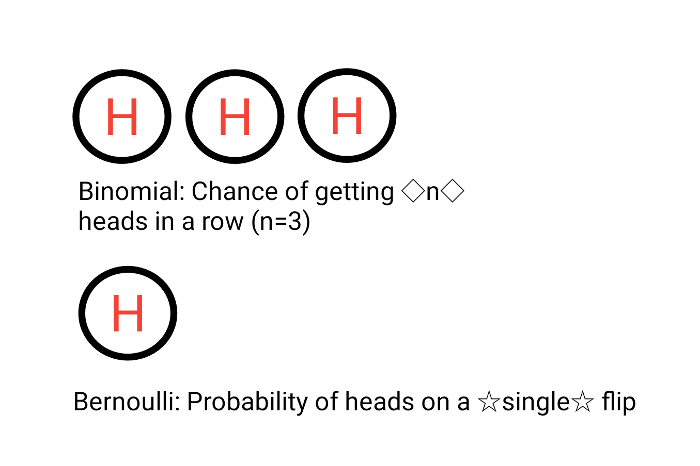

---
output:
  html_document: default
  pdf_document: default
---

# Parameter Estimation

LDA is a generative probabilistic model, so to understand exactly how this works we need to understand the underlying probability distibutions. In this chapter we will focus on the Bernoulli distribution and the Beta distribution. Both of these distributions are very closely related to (and also special cases of) the multinomial and Dirichlet distributions utilized by LDA, but they are a bit easier to comprehend. Once we have made our way through Bernoulli and beta, the following chapter will go into detail about multinomial and Dirichlet distributions and how all these peices are connected. 

Throughout the chapter I'm going to build off of a simple example - a single coin flip. Let's begin. 

## Distributions
### Bernoulli

When you flip a coin you get either heads or tails as an outcome (barring the possibility it lands on it's side). This single coin flip is an example of a Bernoulli trial and we can use the Bernoulli distribution to calculate the probability of either outcome.  Any <i>single</i> trial with two possible outcomes can be modeled as a Bernoulli trial: team wins/loses, pitch is a strike/ball, coin comes up heads or tails, etc.   


#### Bernoulli: A Special Case of the Binomial Distribution
You will often see Bernoulli distribution mentioned as a special case of the Binomial distribution. The binomial model consists of _n_ Bernoulli trials, where each trial is independent and the probability of success does not change between trials.[@kerns2010introduction]. The Bernoulli distribution is the case of a single trial or _n_=1. 

__NOTE:__ I will use the term <i>success</i> interchangably with the term <i>heads</i> when describing bernoulli distribution. In reality <i>success</i> could be <i>tails</i> if you choose to define it that way. 

To clarify, if I want to calculate the probability of getting heads on a single coin flip I will use a bernoulli distribution. However, if I want to know the probability of getting 2 heads (or more) in a row, this is where the binomial distribution comes in. For our purposes we are only concerned about the outcome of a single coin flip and will therefore stick to the Bernoulli distribution. 

```{r BernVSBin, echo = FALSE, fig.cap = 'Bernoulli and Binomial Distributions'}

```

#### Bernoulli - Distribution Notation
The probability mass function of the bernoulli distribution is shown in Equation 1. 

$$
f_{x}(x)=P(X=x)=\theta^{x}(1-\theta)^{1-x}, \hspace{1cm} x = \{0,1\} 
\tag{1}
$$

The only parameter of the bernoulli distribution is $\theta$, which defines the probability of success during a bernoulli trial. The value of _x_ is 0 for a failure and 1 for a success. In a practical example you can think of this as 0 for tails and 1 for heads during a coin flip. In Equation 2 the value of $\theta$ is set to 0.7. We can see the probability of getting a success is 0.7, while the probability of failure is 0.3. 


$$
\begin{aligned}
P(X=1)&=\theta^{1}(1-\theta)^{1-1}, \hspace{1cm} \theta=0.7 \\
P(X=1)&=0.7*1=0.7 \\\\
P(X=0)&=0.7^{0}(1-0.7)^{1-0}\\
P(X=0)&=0.3
\end{aligned}
\tag{2}
$$

### Beta Distribution

The beta distribution can be thought of as a probability distribution of 
distributions[@Robinson2014beta]. 

We know the bernoulli distribution has one parameter, $\theta$. We can use the beta distribution to determine the probability of a specific value of $\theta$ based on prior information, in our case previous coin flips. 

If you flip a coin 2 times resulting in 1 heads and 1 tails how sure are you that the coin is fair? Probably not all that sure, right? But what if you flipped the coin 200 times and it resulted in 100 heads and 100 tails? You would be much more confident that the coin is fair. This is the basis of the beta distribution.

The beta distribution has 2 shape parameters, $\alpha$ and $\beta$. These can be though of as the results from the coin flips we just talked about. Below the probability density for different values of $\theta$ is displayed based on different values of $\alpha$ and $\beta$. In general, the higher the value of $\alpha$ and $\beta$ the narrower the density curve is. This makes sense with our thought example above, the more information (_coin flip results_) we have, the more confident we are in our coin's bias (i.e. is it fair, head heavy, etc.). 

```{r betashape, echo = TRUE, fig.cap = 'Beta Distribution'}
library(tidyverse)
a <- c(1, 10, 100)
b <- c(1, 10, 100)
params <- cbind(a,b)
ds <- NULL
n <- seq(0,1,0.01)
for(i in 1:nrow(params)){
  ds <- rbind(data.frame(x = n, y = dbeta(n, params[i,1], params[i,2]),
                             parameters = paste0("\U03B1 = ",params[i,1],
                                                 ", \U03B2 = ", params[i,2])), ds)
}

ggplot(ds, aes(x = x, y = y, color=parameters)) + geom_line() + 
  labs(x = '\U03B8', y = 'Probability Density') +
  scale_color_discrete(name=NULL) + theme_minimal()

```

What about the cases where $\alpha$ and $\beta$ are not equal or close to equal? Well in those 
cases you would probably assume a bit of skew in the distribution, i.e. your coin may
be biased toward head or tails as shown below.  

```{r betaShapeSkewed, echo = TRUE, fig.cap = 'Beta Distribution - Skewed'}
a <- c(8, 2)
b <- c(2, 8)
params <- cbind(a,b)
ds <- NULL
n <- seq(0,1,0.01)
for(i in 1:nrow(params)){
  ds <- rbind(data.frame(x = n, y = dbeta(n, params[i,1], params[i,2]),
                             parameters = paste0("\U03B1 = ",params[i,1],
                                                 ", \U03B2 = ", params[i,2])), ds)
}

ggplot(ds, aes(x = x, y = y, color=parameters)) + geom_line() + 
  labs(x = '\U03B8', y = 'Probability Density') +
  scale_color_manual(name=NULL, values = c("#7A99AC", "#E4002B")) + theme_minimal()

```


The probability distribution function for the beta distribution can be found below. 

$$
f(\theta;\alpha,\beta) ={{\theta^{(\alpha-1)}(1-\theta)^{(\beta-1)}}\over B(\alpha,\beta)}
$$

Quick Note: 

* The _Beta_ function, _B_ is the ratio of the product of the _Gamma_ function, $\Gamma$, of each parameter divided by the _Gamma_ function of the sum of the parameters. The _Beta_ function is __not__ the same as the beta distribution. The _Beta_ function is shown below along with the _Gamma_ function, which is used in the _Beta_ function.  

$$
\beta(a,b) = {\Gamma(a)\Gamma(b) \over{\Gamma(a+b)}}
$$

* The *Gamma* function is the factorial of the parameter minus 1. 

$$
\Gamma(a) = (a-1)!
$$


## Inference: The Building Blocks

The equation below is a fundamental to understanding parameter estimation and inference. 

$$
\underbrace{p(\theta|D)}_{posterior} = {\overbrace{p(D|\theta)}^{likelihood}
  \overbrace{p(\theta)}^{prior} \over \underbrace{p(D)}_{evidence}}
\tag{3}
$$

The 4 components are:

* __Prior__: The probability of the parameter(s). Defines our prior beliefs of the parameter. Do we _believe_ to a good degree of 
certainty that the coin is fair?  Maybe take a step back and ask yourself 'do I 
trust the manufacturer of this coin?'. If this manufacturer has always had great quality
(i.e. fair coins) then you would have some confidence that your case is no different. 
* __Posterior__: The probability of the parameter __given__ the evidence. The only way 
to know this value is to already have the evidence. However we can estimate the posterior in various ways. Think of 
it this way, given 100 coin flips with 47 heads and 53 tails what is the probability that theta is 0.5 (coin is fair)?
* __Likelihood__: The probability of the evidence __given__ the parameter. Given that 
we know the coin is fair (theta = 0.5) what is the probability of having 47 heads out of 100 flips? 
* __Evidence__: The probability of all possible outcomes. Probability of 1/100 heads, 2/100 heads, ..., 100/100 heads.


__Conditioning your brain for LDA__ : We are starting with a coin flip, but the eventual goal is to link this back to words appearing in a document. Try to keep in mind that we think of a word similar to the outcome of a coin: a word exists in the document (heads!) or a word doesn't exist in the document (tails!).

## Maximum Likelihood
The simplest method of parameter estimation is the maximum likelihood method. Effectively we calculate the parameter that maximizes the likelihood.


$$ 
\underbrace{p(\theta|D)}_{posterior} = {\overbrace{\bf \Large p(D|\theta)}^{\bf \Large LIKELIHOOD}
  \overbrace{p(\theta)}^{prior} \over \underbrace{p(D)}_{evidence}}
\tag{4}
$$

Let's first discuss what the likelihood is. The likelihood can be described as the probability of getting observed data given a specified value of the parameter, $\theta$.  For example, let's say I've flipped a coin 10 times and got 5 heads, 5 tails. Assuming the coin is fair, $\theta$ equals 0.5, what is the likelihood of observing 5 heads and 5 tails. 

To calculate the likelihood of a parameter given a single outcome we would use the probability mass function:
$$
P(X=x)=\theta^{x}(1-\theta)^{1-x}, \hspace{1cm} x = \{0,1\} 
\tag{5}
$$
Where an outcome of heads equal 1 and tails is 0. Now let's say we have carried out the 10 flips as mentioned previously:
$$
\begin{aligned}
P(X_{1}=x_{1},X_{2}=x_{2},...,X_{10}=x_{10}) &= \prod\limits_{n=1}^{10} \theta^{x}(1-\theta)^{1-x}\\
L(\theta) &= \prod\limits_{n=1}^{10} \theta^{x}(1-\theta)^{1-x}
\end{aligned}
\tag{6}
$$
What is shown in the equations above is the joint probability mass function. Each coin flip is independent so we calculate the product of the PMF's for each trial. This is known as the likelihood function - the likelihood of a value of $\theta$ given our observed data. 

Back to the maximum likelihood....

Our goal is to find the value of $\theta$ which maximizes the likelihood of the observed data. To derive the maximum likelihood we start by taking the log of the likelihood, $\mathcal{L}$. 

$$
\begin{aligned}
\mathcal{L} &= log \prod\limits_{n=1}^N \theta^{x}(1-\theta)^{1-x} \\\\
 &= \sum\limits_{n=1}^N log(\theta^{x}(1-\theta)^{1-x}) \\\\
 &= n^{(1)}log(\theta) + n^{(0)}log(1-\theta)
\end{aligned}
\tag{7}
$$

Differentiate with respect to $\theta$:

$$
{d\mathcal{L} \over d\theta} =  {n^{(1)}\over \theta} - {n^{(0)}\over 1-\theta}
\tag{8}
$$

Set it equal to zero and solve:

$$
\begin{aligned}
{n^{(1)}\over \theta} - {n^{(0)}\over 1-\theta} &= 0  \\ \\
{n^{(1)}\over\theta} &= {n^{(0)}\over 1-\theta} \\ \\
{n^{1} - \theta n^{1}} &= {\theta n^{0}} \\ \\
n^{(1)} &= \theta(n^{(1)} + n^{0}) \\ \\
\theta &= {n^{(1)} \over N}
\end{aligned}
\tag{9}
$$

The value of $\theta$ that maximizes the likelihood is the number of heads over the 
number of flips. 

```{r bernoulliml, echo = TRUE, warning=FALSE, fig.cap = 'Bernoulli Maximum Likelihood'}
heads = 1:10
flips = 10
ds <- data.frame(heads, flips = rep(flips, length(heads)))
ds$theta <- ds$heads/ds$flips


ggplot(ds, aes(x = heads,
               y = theta)) + 
  geom_point(color ='#1520c1', size = 3) + 
  geom_linerange(aes(x=heads,
                     y=NULL, ymax=theta,
                     ymin=0)) +
  scale_x_continuous(breaks = seq(0,10,2), labels = seq(0,10,2)) + 
  labs(y='\U03B8', x="Number of Heads", title ="ML Parameter Estimation: 10 Bernoulli Trials") +
  theme(plot.title = element_text(hjust = 0.5)) + theme_minimal()
```


## Maximum a Posteriori (MAP)
MAP is similar to the method of maximum likelihood estimation, but it also let's us 
include information about our prior beliefs. Unlike ML estimation, MAP estimates parameters by trying to maximize the posterior.

$$
\theta_{MAP}=\underset{\theta}{\operatorname{argmax}} P(\theta|X)
\tag{10}
$$


$$
\require{enclose}
\theta_{MAP}=\underset{\theta}{\operatorname{argmax}}{\overbrace{p(D|\theta)}^{likelihood}
  \overbrace{p(\theta)}^{prior} \over \underbrace{\enclose{horizontalstrike}{p(D)}}_{evidence}}
\tag{11}
$$


The evidence term is dropped during the calculation of $\theta_{MAP}$ since it is not a function of $\theta$ and our only concern is maximizing the posterior based on $\theta$. Similar to calculating the Likelhood, the first step is to apply the log function to the remaining terms. 


$$
\begin{aligned}
\theta_{MAP} &=\underset{\theta}{\operatorname{argmax}}p(D|\theta)p(\theta) \\\\
&= \mathcal{L}(\theta|D) + log(p(\theta))
\end{aligned}
\tag{12}
$$

We have already derived the log likelihood during our derivation of the maximum likelihood, so let's now focus on the prior. The prior for the Bernoulli distribution is the Beta distribution and can be used to describe $p(\theta)$. The probability distribution function, PDF, for the Beta distribution is shown below. 

$$
p(\theta|\alpha,\beta) = {\theta^{\alpha-1}(1-\theta)^{\beta-1}\over{B(\alpha, \beta)}}
\tag{13}
$$

Plugging in the PDF of the beta distribution for the prior:


$$
\begin{aligned}
\theta_{MAP}&= \mathcal{L}(\theta|D) + log(p(\theta)) \\\\
\theta_{MAP}&= n^{(1)}log(\theta) + n^{(0)}log(1-\theta) + log({\theta^{\alpha-1}(1-\theta)^{\beta-1}\over{B(\alpha, \beta)}}) \\\\
\theta_{MAP}&= n^{(1)}log(\theta) + n^{(0)}log(1-\theta) + log({\theta^{\alpha-1}) + log((1-\theta)^{\beta-1})-log({B(\alpha, \beta)}}) \\\\
{d \over d\theta} \mathcal{L}(\theta|D) + log(p(\theta)) &= {n^{(1)}\over \theta} - {n^{(0)}\over 1-\theta} + {\alpha - 1\over\theta} - {\beta - 1 \over 1-\theta}
\\\\
0 &= {n^{(1)}\over \theta} - {n^{(0)}\over 1-\theta} + {\alpha - 1\over\theta} - {\beta - 1 \over 1-\theta}
\\\\
\theta_{MAP}&= {{n^{(1)} + \alpha -1} \over {n^{(1)} + n^{0} + \alpha + \beta - 2}}
\end{aligned}
\tag{14}
$$

Now that we know how to calculate the parameter $\theta$ that maximizes the posterior, lets take a look at how choices of different priors and different number of observed trials effects our outcome.  

In the figure below we see MAP estimation of $\theta$ with a relatively uninformed prior and a small number of observed experiments (n=20). Uninformed means we are going to make a weak assumption about the prior. In more general terms, this means that we don't have a strong intuition that our coin is fair or unfair.  The Beta distribution has $\alpha$ and $\beta$ parameters of 2 resulting in the blue density curve shown below. 


__NOTE__: The terms weak and uninformed are often used interchangeably when referencing priors. The same goes for the terms strong and informed. 

```{r mapSmallnUninformedPrior, echo = TRUE, fig.cap = 'MAP: Small number of experiments and uninformed prior'}
# description:
# ml will yeild the expected average and is not effected by the prior
# map uses a weak assumption - uniform density for all values of theta
# this results in a theta_map value very similar to the ml value
n <- 20
heads <- 14
tails <- 6


# ml
ml_theta <- heads/n
# map
B <- 2
alpha <- 2

map_theta <- (heads + alpha - 1)/(heads + tails + alpha + B -2)
possible_theta <- seq(0,1,0.01)
beta_ds <- data.frame(theta = possible_theta, density = dbeta(possible_theta, alpha,B))
ggplot(beta_ds, aes(x = theta, y = density)) + geom_point(color='#7A99AC') + 
  geom_vline(xintercept=map_theta, color = '#ba0223') + 
  annotate("text", x = map_theta + 0.1, y=0.5, label= paste("\U03B8[MAP]==", round(map_theta,2)), parse=T)+
  labs(x='\U03B8') + theme_minimal()

```


In the next example we have the same number of samples, but we assume a much stronger prior. In particular, we assume the coin is most likely fair by selecting $\alpha$ and $\beta$ parameters of 100. These parameters represent a Beta distribution that is centered at 0.5 and is very dense around that point. We can see the resuting MAP estimate is much closer to 0.5, which is the value of $\theta$ where the Beta distribution is most dense. 

```{r mapSmallnInformedPrior, echo = TRUE, fig.cap = 'MAP: Small number of experiments and informed prior'}
# description:
# the strong assumption of a 'fair' coin prior reduces the width of the 
# distribution, i.e. much higher probability density near theta (p) of 0.5
# This forces the MAP theta value to stay much closer to the prior due to the 
# small amount of observed evidence

n <- 20
heads <- 14
tails <- 6


# ml
ml_theta <- heads/n
# map
B <- 100
alpha <- 100

map_theta <- (heads + alpha - 1)/(heads + tails + alpha + B -2)
possible_theta <- seq(0,1,0.001)
beta_ds <- data.frame(theta = possible_theta, density = dbeta(possible_theta, alpha,B))
ggplot(beta_ds, aes(x = theta, y = density)) + geom_line(color='#7A99AC') + 
  geom_vline(xintercept=map_theta, color = '#ba0223') + 
  annotate("text", x = map_theta + 0.1, y=11, label= paste("\U03B8[MAP]==", round(map_theta,2)), parse=T)+
  labs(x='\U03B8', y = 'Density') + theme_minimal()

```

What happens when we have a much larger number of observed experiments and an uninformed prior? In general, the MAP estimate gives us a value that is very close to a likelihood, heads divide by number of trials. 


```{r mapLargenUninformedPrior, echo = TRUE, fig.cap = 'MAP: Large number of experiments and uninformed prior'}
# description
# high number of observed samples (evidence)
# weak prior - uniform 
# ml and map are close to one another - close... as expected
n <- 1000
heads <- 723
tails <- n-heads


# ml
ml_theta <- heads/n
# map
B <- 2
alpha <- 2
map_theta <- (heads + alpha - 1)/(heads + tails + alpha + B -2)
possible_theta <- seq(0,1,0.001)
beta_ds <- data.frame(theta = possible_theta, density = dbeta(possible_theta, alpha,B))
ggplot(beta_ds, aes(x = theta, y = density)) + geom_line(color='#7A99AC') + 
  geom_vline(xintercept=map_theta, color = '#ba0223') + 
  annotate("text", x = map_theta + 0.1, y=1.2, label= paste("\U03B8[MAP]==", round(map_theta,2)), parse=T)+
  labs(x='\U03B8', y = 'Density') + theme_minimal()
```

Now let's assume a much stronger prior that the coin is fair while using the same number of experiments. Notice that when we use a larger number of experiments it overpowers the strong prior and gives us a very similar MAP estimate in comparison to the example with the uninformed prior and the same number of experiments. 


```{r mapLargeInformedPrior, echo = TRUE, fig.cap = 'MAP: Large number of experiments and informed prior'}

n <- 1000
heads <- 723
tails <- n-heads


# ml
ml_theta <- heads/n
# map
B <- 100
alpha <- 100
possible_theta <- seq(0,1,0.001)
beta_ds <- data.frame(theta = possible_theta, density = dbeta(possible_theta, alpha,B))
map_theta <- (heads + alpha - 1)/(heads + tails + alpha + B -2)
ggplot(beta_ds, aes(x = theta, y = density)) + 
  geom_line(color='#7A99AC') + 
  geom_vline(xintercept=map_theta, color = '#ba0223') + 
  annotate("text", x = map_theta + 0.1, y=8.2, label= paste("\U03B8[MAP]==", round(map_theta,2)), parse=T)+
  labs(x='\U03B8', y = 'Density') + theme_minimal()
```

In summary:

* The stronger your prior assumptions are, the more observations you will need to overcome an incorrect prior.
* Stronger prior  - MAP estimate moves toward most dense area of prior distribution
* Weaker prior    - MAP looks more like a maximum likelihood


## Bayesian Inference

Another option we have for estimating parameters is to estimate the posterior of the distribution via Bayesian inference. In MAP estimation we included prior assumptions as part of our calculation. We are going to do the same via Bayesian Inference however instead of a point estimate of $\theta$, we will be calculating the posterior distribution over all possible values of $\theta$. From this we can take the expected value of $\theta$ as our estimated parameter. 


In the case of the coin flip, Bayesian inference can be solved analytically. We have reviewed the likelihood and the prior, but when estimating the posterior we need to include the evidence term. This is somewhat tricky.

$$
\underbrace{p(\theta|D)}_{posterior} = { p(D|\theta)
  p(\theta) \over \underbrace{p(D)}_{evidence}}
\tag{15}
$$

$$
p(D) = \int_{\theta}p(D|\theta)p(\theta)d\theta
\tag{16}
$$

$$
{p(\theta|z,N)} = {\overbrace{\theta^z(1-\theta)^{(N-z)}}^{likelihood} \overbrace{{\theta^{(a-1)}(1-\theta)^{(b-1)}}\over \beta(a,b)}^{prior}\over{\underbrace{\int_{0}^1 \theta^z(1-\theta)^{(N-z)}{{\theta^{(a-1)}(1-\theta)^{(b-1)}}\over \beta(a,b)}d\theta}_{Evidence}}}
\tag{17}
$$

Note that the evidence term is actually a constant value since it is an integral over all values of $\theta$. The evidence term is used as a scaling factor to ensure our probabilities sum to 1. We will plug in a generic placeholder of our evidence value since we have established that it is a constant.

$$
\begin{aligned}
p(\theta|z, N) &= {\theta^{z}(1-\theta)^{(N-z)}{{\theta^{(a-1)}(1-\theta)^{(b-1)}}\over \beta(a,b)}\over{C}} \\\\
 &= {\theta^{(z+a-1)}(1-\theta)^{(N-z+b-1)} \over \beta(z+a, N-z+b)}\\\\
 &= Beta(z+a, N-z+b)
\end{aligned}
\tag{18}
$$

Notice what happens in the second step of equation 18. I combine the Beta function term and the constant evidence term. The Beta function in this equation is also a constant value. Therefore when we combine the likelihood and prior we alter the Beta function's parameters and drop the constant for the evidence term. This leaves us with a Beta distribution for our posterior that includse our observed experiments and our prior's hyperparameters.

????????????? Possibly rephrase the above to specify that we are preserving the scaling of the posterior... ??????????????

To estimate $\theta$, we calculate the expected value of a Beta distribution as shown in Equation 19. 

$$
E[\theta]={\alpha \over \alpha + \beta}
\tag{19}
$$

Plugging in our parameters as per the derivation in Equation 18: 

$$
\begin{aligned}
E[\theta] &= {z+a \over {z+a + n-z+b}}\\\\
&={z+a \over {a+N+b}}\\\\
\end{aligned}
\tag{20}
$$


```{r BISmallUninformedPrior, echo = TRUE, fig.cap = 'Bayesian Inference: Analytical Solution (n=20)'}

n <- 20
heads <- 14
tails <- n-heads


# ml
ml_theta <- heads/n
# map
B <- 2
alpha <- 2
possible_theta <- seq(0,1,0.001)
beta_ds <- data.frame(theta = possible_theta, density = dbeta(possible_theta, alpha,B))
map_theta <- (heads + alpha)/(alpha + n + B) 
ggplot(beta_ds, aes(x = theta, y = density)) + 
  geom_line(color='#7A99AC') + 
  geom_vline(xintercept=map_theta, color = '#ba0223') + 
  annotate("text", x = map_theta + 0.08, y=1.4, label= paste("\U03B8[BI]==", round(map_theta,2)), parse=T)+
  labs(x='\U03B8', y = 'Density') + theme_minimal()
```

Keep in mind Bayesian inference is effected by the selection of a prior and the number of observations in the same way MAP estimation is. 


### The Issue of Intractability
The coin flip example solved via Bayesian inference was capable of being solved analytically. However in many cases of Bayesian inference this is not possible due to the intractability of solving for the marginal likelihood (evidence term). We do have other options for solutions such as Gibbs sampling, expectation-maximization, and Metropolis-Hastings methods. This book will only focus on Gibbs Sampling, but be aware other types of solvers are used for Bayesian inference, and in particular LDA.

### A Tale of Two MC's
Gibbs Sampling is a Markov Chain Monte Carlo (MCMC) technique for parameter estimation.  Let's break down the two MC's. A markov chain is a process where the next state is determined by the current state. More importantly it does not rely on any information prior to the current state. 
?????
1. This needs a diagram and possibly a general example. 
2. LETS MAKE SURE TO REITERATE THIS AFTER SHOWING THE GENERAL GIBBS SAMPLING MATH AND DIAGRAM 
????
The other MC, Monte Carlo, is a technique used to solve a variety of problems by repeated random sampling. A common example used to showcase Monte Carlo methods is the estimation of the value of $\pi$. All we need is some chalk and a bucket of rice. I draw a circle on the ground. I then draw a square along the circumference of the square. Now for the bucket of rice, aka our random number generator. I stand over the square and uniformly pour rice over the area of the square. Now comes the monotonous part, counting the rice. First I count the number of pieces of rice inside the circle. Next I tally the number of pieces of rice remaining. From here I can infer the value of $\pi$ as follows:

$$
\begin{aligned}
{Rice_{circle}\over Rice_{circle + square}} &= {\pi r^{2} \over (2r)^{2}}\\\\
\pi &\approx {4Rice_{circle}\over Rice_{circle + square}}
\end{aligned}
$$


### Conjugate Priors

Before wading into the deeper water that is Gibbs sampling I need to touch on the concept of conjugate priors. 
The general premise of conjugate priors is that the prior has the same form 
as the posterior distribution. Ok, but what does that mean for us? In a pragmatic 
sense, it means we need to look for a __pattern__ when solving for our posterior. 

__PATTERN MATCHING__


????????? Double check the 'observed data' statement here ???????????????

Let's take the coin flip example. We want to estimate the posterior, the 
probability of $\theta$ given the the results of all experiments (this includes experiments that we haven't yet completed). Obviously we don't have data which does not yet exist (i.e. all experiments) so we will need to use the likelihood and the prior to estimate the posterior. 

#### Bernoulli & Beta

In previous example we have used the Beta distribution to calculate the prior. What I did not point out is that the Beta distribution is the conjugate prior of the Bernoulli distribution. 

We start with our base relationship between posterior, likelihood, prior, and posterior. 

$$
\underbrace{p(\theta|D)}_{posterior} = {\overbrace{p(D|\theta)}^{likelihood}
  \overbrace{p(\theta)}^{prior} \over \underbrace{p(D)}_{evidence}}
\tag{21}
$$

When estimating the posterior we drop out the evidence term. To reiterate, we can drop out the evidence term because it is constant and is used as a normalizing factor for scaling our probabilities to so that they sum to 1. We will see in the upcoming section that Gibbs sampling accounts for the scaling issue and allows us to infer probabilities at the correct scale. 

$$
\underbrace{p(\theta|D)}_{posterior}  \propto  {\overbrace{p(D|\theta)}^{likelihood}
  \overbrace{p(\theta)}^{prior}}
\tag{22}
$$

To estimate the posterior of the bernoulli distribution we plug in our likelihood and prior (_Beta distribution_) equations. 


$$
p(\theta|z,N) \propto \overbrace{\theta^z(1-\theta)^{(N-z)}}^{likelihood} \overbrace{{\theta^{(a-1)}(1-\theta)^{(b-1)}}\over \beta(a,b)}^{prior}
\tag{23}
$$

After combining terms we get the following equation. Note that the Beta function parameters were not altered in Equation 24 which is different from the BI example (_Equation 18_). In the BI example we needed to conserve the scaling of the posterior estimate, but with Gibbs Sampling this is not necessary. 

$$
p(\theta|z,N) \propto {\overbrace{\theta^{(a + z -1)}(1-\theta)^{(N-z+b-1)}}^{Same \hspace{1 mm} Pattern \hspace{1 mm} as \hspace{1 mm} Prior}\over{\beta(a,b)}}
\tag{24}
$$

### Gibbs Sampling

Gibbs sampling is a Markov Chain Monte Carlo technique that can be used for estimating parameters by walking through a given parameter space.

::ADD IN :: 
BACKGROUND ABOUT MCMC
::

A very generalized way to think of Gibbs sampling is estimating a given parameter based on what we currently know about all other parameters. You may be thinking 'What other parameters?'. Gibbs sampling is only really applicable when you are trying to estimate multiple parameters. The coin flip example will now be expanded a bit: we are going to compare the bias of two coins to see if the there is any discernable difference between the two coins. 

Mathematical representation of what happens in Gibbs Sampling:

$$
\begin{aligned}
&p(\theta_{1}^{i+1}) \sim p(\theta_{1}^{i}|\theta_{2}^{i}, \theta_{3}^{i},..., \theta{n}^{i}) \\
&p(\theta_{2}^{i+1}) \sim p(\theta_{2}^{i}|\theta_{1}^{i+1}, \theta_{3}^{i},..., \theta{n}^{i}) \\
&p(\theta_{3}^{i+1}) \sim p(\theta_{3}^{i}|\theta_{1}^{i+1}, \theta_{2}^{i+1},..., \theta{n}^{i}) \\
&................................ \\ 
&p(\theta_{n}^{i+1}) \sim p(\theta_{n}^{i}|\theta_{1}^{i+1}, \theta_{2}^{i+1},..., \theta_{n-1}^{i+1}) \\
\end{aligned}
\tag{25}
$$

In Equation 25 we see the next estimate, _i+1_, of $\theta_{1}$ is based on all other current parameter values. When estimating $\theta_{2}$ the _i+1_ value of $\theta__{1}$ is used along with all of the current (_i_) parameter values. The is continues for all parameter values. After the the _nth_ parameter is estimated, the process starts all over again until a specific stopping criteria is met. 

### Bias of Two Coins
Code example of 2 coins

```{r 2coins, echo = TRUE, warning=FALSE, message=FALSE, cache = FALSE, fig.cap = 'Bias of Two Coins: Theta 1'}
a = 2
b = 2

z1 = 11
N1 = 14
z2 = 7
N2 = 14


theta = rep(0.5,2)
niters = 10000
burnin = 500

thetas = matrix(0, nrow = (niters-burnin), ncol=2)
for (i in 1:niters){

  theta1 = rbeta(n = 1, shape1 = a + z1, shape2 = b + N1 - z1)
  # get value theta2| all other vars
  theta2 = rbeta(n = 1, shape1 = a + z2, shape2 =b + N2 - z2)
  
  if (i >= burnin){
    thetas[(i-burnin), ] = c(theta1, theta2)
  }
}


ds <- data.frame(theta1 = thetas[,1], theta2= thetas[,2])
ggplot(ds, aes(x=theta1)) + geom_histogram(aes(y=..density..),color='#1A384A', fill='#7A99AC') + 
  labs(title = expression(theta[1]~Estimate), x=expression(theta[1]), y = 'Density') + 
  geom_vline(xintercept = mean(ds$theta1), color='#b7091a') +
  theme_minimal()
```
```{r 2coins2, echo = TRUE, warning=FALSE,message=FALSE, fig.cap = 'Bias of Two Coins - Theta 2'}
ggplot(ds, aes(x=theta2)) + geom_histogram(aes(y=..density..),color='#1A384A', fill='#7A99AC') + 
  labs(title = expression(theta[2]~Estimate), x=expression(theta[2]), y = 'Density') + 
  geom_vline(xintercept = mean(ds$theta2), color='#b7091a') + 
  theme_minimal()

```


::ADD IN::
Discussion of example, possibly code example of expected value? I think this is important so that we can provide a probability of theta given the data - i.e. how many samples are in range of theta = 0.5 - 0.6 - i.e. confidence intervals....
Regardless you need to hit on the way that Gibbs sampling takes care of scaling. 
::


### Change Point Example
What if the problem we are solving is more complicated. Let's say I flip a coin repeatedly, but at some point I switch to another coin with a different bias ($\theta$). I want to detect the point in time when coin 1 was swapped out for coin 2. 

IMAGE PLACE HOLDER - MAKE A DRAWING OF FLIPPING TWO COINS ON A TIME SCALE


```{r bern_change_point, echo = TRUE, warning=FALSE,message=FALSE, cache = FALSE}
real_thetas <- c(0.2, 0.6)
N <- 300
a = 2
b = 3
change_point <- 100
x <- c(rbinom(1:change_point, 1, real_thetas[1]),rbinom((change_point+1):N, 1, real_thetas[2]))


## Initialize all parameters

# n ~ uniform 
n <- round(N*runif(1))
# theta1 ~ beta(a,b)
theta1 <- rbeta(1, a, b)
# theta2 ~ beta(a,b)
theta2 <- rbeta(1, a, b)


niters = 10000
burnin = 2000
# sigma = np.diag([0.2,0.2])

# thetas = np.zeros((niters-burnin,2), np.float)
params = matrix(0, nrow = (niters-burnin), ncol=3)
for (i in 1:niters){
  
  
  z1 <- sum(x[1:n])
  if(n == N){
    z2 <- 0
  }else{
    z2 <- sum(x[(n+1):N])
  }
  theta1 = rbeta(n = 1, shape1 = a + z1, shape2 = b + n - z1)
  # get value theta2| all other vars
  theta2 = rbeta(n = 1, shape1 = a + z2, shape2 =N-n-1-z2+b)
  
  
  ## 2 things: 1 - should I be summing all the values over these? 
  # No - the product is being calculated due to the sum - should be fine
  n_multi <- rep(0, N)
  for(steps in 1:N){
    if(steps==N || theta2 == 1){
      n_multi[steps] <- log(theta1^sum(x[1:steps]) * (1-theta1)^(steps-sum(x[1:steps])))
    }else{
      n_multi[steps] <- log(theta1^sum(x[1:steps]) * (1-theta1)^(steps-sum(x[1:steps]))) +
        log(theta2^sum(x[(steps + 1):N]) * (1-theta2)^(N-steps-1-sum(x[(steps+1):N])))
    }
  }
  
  n_multi <- exp(n_multi - max(n_multi))
  # what about for n? 
  n <- which(rmultinom(1, 1, n_multi/sum(n_multi))[,1] ==1)
  if (i >= burnin){
    params[(i-burnin), ] = c(theta1,theta2, n)
  }
}

ds <- data.frame(x = x, theta = c(rep(real_thetas[1],N-change_point),
                                  rep(real_thetas[2],change_point)), 
                 sample_index = seq(1:length(x)))

```


```{r bernChangePointN, echo = TRUE, warning=FALSE,message=FALSE, fig.cap = 'Estimated Change Point'}
params_df <- as.data.frame(params)
names(params_df) <- c('theta1', 'theta2', 'change_point')

ggplot(params_df, aes(x = change_point)) + 
  geom_histogram(fill="#7A99AC", color ='#1A384A') +
  theme_minimal() + 
  geom_vline(xintercept = mean(params_df$change_point), color='#b7091a') +
  labs(title = 'Change Point Estimate', x='Change Point', y = 'Density') 

```


```{r bernChangePointTheta1, echo = TRUE, warning=FALSE,message=FALSE, fig.cap = 'Estimated Theta 1'}

ggplot(params_df, aes(x = theta1)) + 
  geom_histogram(fill="#7A99AC", color ='#1A384A' ) + 
  theme_minimal() + 
  geom_vline(xintercept = mean(params_df$theta1), color='#b7091a') +
  labs(title = expression(theta[1]~Estimate), x=expression(theta[1]), y = 'Density') 

```

```{r bernChangePointTheta2, echo = TRUE, warning=FALSE,message=FALSE, fig.cap = 'Estimated Theta 2'}
ggplot(params_df, aes(x = theta2)) + 
  geom_histogram(fill="#7A99AC", color ='#1A384A' ) + 
  theme_minimal() + 
  geom_vline(xintercept = mean(params_df$theta2), color='#b7091a') +
  labs(title = expression(theta[2]~Estimate), x=expression(theta[2]), y = 'Density') 

```


