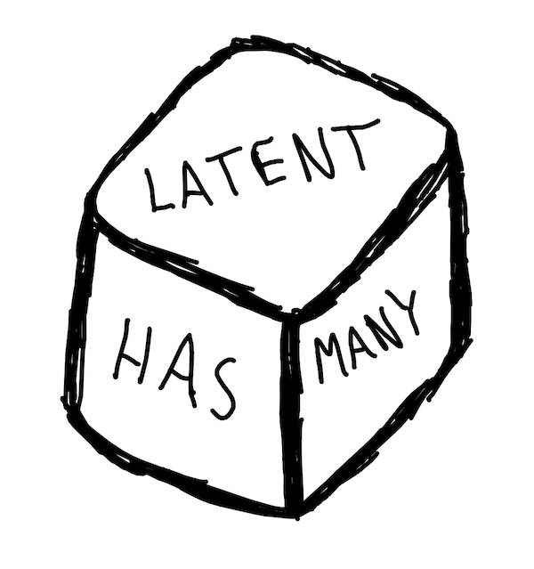

# Multinomial Distribution

This chapter focuses on the multinomial distribution which we will use to model the probability of words in a document. Similar to the previous chapter, we will cover the conjugate prior for the multinomial distributoin, the Dirichlet distribution.

## Comparison of Dice vs. Words

The premise of Chapter 2 was to lay a foundation for understanding the multinomial distribution. We are now familiar with the binomial distribution which is actually a special case of the multinomial distribution 
where the number of possible outcomes is 2. A multinomial distribution can 
have 2 or more outcomes and therefore is normally shown through examples using 
a 6-sided die. Instead of using a die with numbers on each side, let's label the sides with the following words:

"Latent" "Dirichlet" "Allocation" "has" "many" "peices"

```{r WordDie, echo = FALSE, fig.cap = 'Dice for Word Selection',  out.width = '33%', out.height='33%'}

```

In the example above, we assume it is a fair die which would result in equal probabilities of 'rolling' any of the 6 unique words. Therefore each word has a probability of being randomly sampled from the die of 1/6. 

Below is an empirical example where we take each word and assign it to a single side of a fair die. The experiment, a single roll of the die, is repeated 10,000 times. We can see each word comes up at roughly the same frequency.  

```{r echo = FALSE, warning=FALSE, message=FALSE}
rm(list = ls())
library(MCMCpack)
library(tidyverse)
library(knitr)
```

```{r multinomialDist, echo = TRUE, warning=FALSE, message=FALSE, fig.cap = 'Sampling from Multinomial with Equal Parameters'}
# draw 1000 samples from multinomial distribution
outcomes <- replicate(10000, which(rmultinom(1,1,rep(1/6,6))==1))
words <- unlist(strsplit("Latent Dirichlet Allocation has many peices", ' '))
ds <- data.frame(id = outcomes, word = sapply(outcomes, function(x)words[x]))
ggplot(ds, aes(x= word)) + geom_histogram(stat='count',color='#1A384A', fill='#7A99AC') +
  scale_x_discrete(labels = words) +
  theme_minimal()

```


__Quick Note:__     
_Let's think of how this will be used in the case of LDA. If I wanted to generate a document based on a model, I could use a multinomial distribution to determine what words would be in the document. If I knew the probability of a word I could use the example above to draw a new word with each sample. Obviously some words occur much more often than others, so the 'fair die' example wouldn't work for generation of document.  In later sections we will build on this concept, but its good to start thinking about how this extends to applications in language._


## How Multinomial and Bernoulli Relate

The probability mass function for the multinomial distribution is shown in Equation \@ref(eq:multiPMF):


$$
\begin{equation}
f(x)=\dfrac{n!}{x_1!x_2!\cdots x_k!}\theta_1^{x_1} \theta_2^{x_2} \cdots \theta_k^{x_k}
(\#eq:multiPMF)
\end{equation}
$$

* <i>k</i> - number of sides on the die
* <i>n</i> - number of times the die will be rolled

The multinomial representation of the distributions we've already discussed, binomial and bernoulli, would use the following parameters:

* _k_ sided die rolled _n_ times
    * _n_ = 1,  _k_ = 2 is bernoulli distribution: coin has 2 sides and we are only concerned with single experiments
    * _n_ > 1 , _k_ = 2 is binomial distribution: coin has 2 sides, but we are concerned with the probability of the outcome of a series of flips. 

To help illustrate the relationship between Bernoulli and Multinomial distributions we need to recall the bernoulli probability mass function shown in Equation \@ref(eq:bernPMFmulti). 

$$
\begin{equation}
f(x)=P(X=x)=\theta^{x}(1-\theta)^{1-x}, \hspace{1cm} x = \{0,1\}
(\#eq:bernPMFmulti)
\end{equation}
$$
Let's swap in some different terms. We can replace the first term, $\theta$, with $\theta_{1}$ and the second term, $(1-\theta)$ as $\theta_{2}$. This can be thought of as $\theta_{heads}$ and $\theta_{tails}$ for our coin flip example. 

$$
\begin{equation}
f(x)={\theta_{1}}^{x_{1}}{\theta_{2}}^{x_{2}} \\
(\#eq:bern2Multi)
\end{equation}
$$

You can see this looks a bit more like the multinomial PDF,Equation \@ref(eq:bernPMFmulti), but the factorial terms are not present. In this case _k_=2 and _n_=1 and _x_'s can only have a value of  1 or zero. The values of a bernoulli distribution are plugged into the multinomial PDF in Equation \@ref(eq:multiWBernSettings). Factorial of _n_ in the numerator is always 1 since it is a single trial, i.e. _n_=1, and the denominator is also always 1 since our only possible outcomes are 0 and 1 (heads or tails). Once we simplify, we see the relationship that was stated previously: the bernoulli distribution is a special case of the multinomial distribution. 


$$
\begin{equation}
\begin{aligned}
f(x)&=\dfrac{n!}{x_1!x_2!\cdots x_k!}\theta_1^{x_1} \theta_2^{x_2} \cdots \theta_k^{x_k} \\
f(x)&=\dfrac{1}{1}\theta_1^{x_1} \theta_2^{x_2} \\
f(x)&={\theta_{1}}^{x_{1}}{\theta_{2}}^{x_{2}}
\end{aligned}
(\#eq:multiWBernSettings)
\end{equation}
$$


## Conjugate Prior: Dirichlet
The conjugate prior for the multinomial distribution is the Dirichlet distribution. Similar
to the beta distribution, Dirichlet can be thought of as a distribution of distributions. Also note that the beta distribution is the special case of a Dirichlet distribution where the number of possible outcome is 2. This is similar to the relationship between the binomial and multinomial distributions. 

The probability distribution function for the Dirichlet distribution is shown in Equation \@ref(eq:dirPDF). 


$$
\begin{equation}
Dir(\overrightarrow{\theta}|\overrightarrow{\alpha})=
{ 
  {\Gamma {\bigl (}\sum _{i=1}^{K}\alpha _{i}{\bigr )}}
  \over{\prod _{i=1}^{K}\Gamma (\alpha _{i})}
}
\prod _{i=1}^{K}\theta_{i}^{\alpha _{i}-1}
(\#eq:dirPDF)
\end{equation}
$$

Equation \@ref(eq:dirPDF) is often written using the Beta function in place of the first term as seen below:   

$$
Dir(\overrightarrow{\theta}|\overrightarrow{\alpha})=
{ 
  1 \over B(\alpha)
}
\prod _{i=1}^{K}\theta_{i}^{\alpha _{i}-1} 
$$

Where: 
$$
{1\over B(\alpha)}={ 
  {\Gamma {\bigl (}\sum _{i=1}^{K}\alpha _{i}{\bigr )}}
  \over{\prod _{i=1}^{K}\Gamma (\alpha _{i})}
}
$$

The Dirichlet distribution is an extension of the beta distribution for <i>k</i> categories, similar to the relationship between multinomial and bernoulli distributions. To get a better sense of what the distributions look like, let's visualize a few examples at <i>k</i>=3. In both of the box plots below 10,000 random samples were drawn from a Dirichlet distribution where <i>k</i>=3 and $\alpha$ is the same for each <i>k</i> in the given plot. The first plot shows the distribution of values drawn when $\alpha$ = 100.  

```{r DirichletAlpha100, echo = TRUE, warning=FALSE, message=FALSE, fig.cap = 'Sampling from Dirichlet: \U03B1=100' }
alpha <- c(100,100,100)
trials <- 10000
x <- rdirichlet(trials, alpha)
colnames(x) <- c('theta_1', 'theta_2', 'theta_3')
ds <- cbind(as.tibble(x), trial = 1:trials) %>% 
  gather(theta, word, -trial)

ggplot(ds, aes(color = theta, fill = theta, x = theta, y = word)) + geom_boxplot(alpha = 0.3) + 
  theme_minimal() + 
  labs(y='\U03B8', x = '', title = paste0("\U03B1 = ",unique(alpha)) ) + 
  scale_x_discrete(labels = c(expression("\U03B1"[1]),
                              expression("\U03B1"[2]),
                              expression("\U03B1"[3]))) + 
  scale_fill_discrete(guide = FALSE) + 
  scale_color_discrete(guide = FALSE)+ 
  scale_y_continuous(limits = c(0,1))
```

Below the process is repeated, but this time the $\alpha$ values are set to 1 for each category. We can see the range of distribution of values sampled with the higher $\alpha$ value is much narrower than the distribution of values sampled using $\alpha$ values of 1. This is the same pattern we saw with the beta distribution; as the shape parameters increased the distribution became more dense and the shape of the distribution narrowed.  

```{r DirichletAlpha1, echo = TRUE, warning=FALSE, message=FALSE, fig.cap = 'Sampling from Dirichlet - \U03B8=1' }
alpha <- c(1,1,1)
  x <- rdirichlet(trials, alpha)
colnames(x) <- c('theta_1', 'theta_2', 'theta_3')
ds <- cbind(as.tibble(x), trial = 1:trials) %>% 
  gather(theta, word, -trial)

ggplot(ds, aes(color = theta, fill = theta, x = theta, y = word)) + geom_boxplot(alpha = 0.3) + 
  theme_minimal() + 
  labs(y='\U03B8', x = '', title = paste0("\U03B1 = ",unique(alpha)) ) + 
  scale_x_discrete(labels = c(expression("\U03B1"[1]),
                              expression("\U03B1"[2]),
                              expression("\U03B1"[3]))) + 
  scale_fill_discrete(guide = FALSE) + 
  scale_color_discrete(guide = FALSE) + 
  scale_y_continuous(limits = c(0,1))
```

So what happens when the $\alpha$ values are not the same, i.e. the distribution is asymmetrical? In the histogram below, we see the distribution of values sampled from the dirichlet distribution for each category. The distribution of samples for each category ($\alpha_{i}$ value), are approximately centered at the ratio of the $\alpha_{i}$ value to the sum of all $\alpha$ values.  This is similar to the shift of the beta distribution when using hyperparameters that were unequal (see Figure \@ref(fig:betaShapeSkewed)). 


```{r DirichletAlphaMixed, echo = TRUE, warning=FALSE, message=FALSE, fig.cap = 'Sampling from Dirichlet: \U03B8=[10,50,20]'}
alpha <- c(10,50,20)
alpha_prop <- alpha/sum(alpha)
x <- rdirichlet(trials, alpha)
colnames(x) <- c('theta_1', 'theta_2', 'theta_3')
ds <- cbind(as.tibble(x), trial = 1:trials) %>% 
  gather(theta, word, -trial)

ggplot(ds, aes(color = theta, fill=theta, x = word)) + geom_histogram(position='identity', alpha = 0.1) +
  # geom_line(stat='density') + 
  theme_minimal() + 
  labs(x = "\U03B8", y = "Count") + 
  scale_color_discrete(label = alpha,
                       name = "\U03B1" ) +
  scale_fill_discrete(label = alpha,
                       name = "\U03B1" )

```

## Gibbs Sampling - Multinomial & Dirichlet

Prior to getting into an example of Gibbs sampling as it applies to inferring the parameters of a multinomial distribution, let's first describe a model which generates words for a single document. As you can imagine this would be modeled as a multinomial distribution with parameters $\overrightarrow{\theta} = \theta_{1}, \theta_{2}, ... \theta_{n}$ for words 1 to n. The model would be capable of generating a bag of words representation of a document. The term <i>'bag of words'</i> refers to words in no particular order, i.e. the document we would be generating would not have structured sentences, but would contain all the components of the document. The model will be used to generate a document using a limited vocabulary, only 3 distinct words: `r '\U1F4D8'`,`r '\U1F4D5'`,`r '\U1F4D7'`.

First we are going to create a seed document which I will refer to as an _ideal_ document. The document is used as a basis of our $\alpha$'s for our prior described by the Dirichlet distribution. To create this document we first define the mixture of words in the document: 

* `r '\U1F4D8'` : 10%
* `r '\U1F4D5'` : 10%
* `r '\U1F4D7'` : 80%

To clarify, this means the document will contain 80% blue books, 10% green books, and 10% red books: 

```{r unigram_document ,echo = TRUE, warning=FALSE, message=FALSE}
# use letters function as your vocabulary
v <- c('red', 'green', 'blue')
nwords <- 10
doc_theta <- c(.1, .1, .8)
document<-rep(v, doc_theta*nwords)
books <- tibble(label = c('blue', 'red', 'green'), 
                    code = c('\U1F4D8', '\U1F4D5', '\U1F4D7'))

cat(sapply(document, function(x) books$code[which(books$label == x)]))
``` 


Do you recall the beta/bernoulli example? The way we informed our prior was using some prior information we had, i.e. the number of heads and tails previously obtained from flipping the two coins. We will use the document above as the basis of our $\alpha$ paramters for the Dirichlet distribution, i.e. our prior for the multinomial. In more general language, we want to generate documents similar to our 'ideal' document. 


So let's generate a new document using the word counts from our <i>ideal</i> document as our $\alpha$ values for the dirichlet prior. Then we use the $\theta$ values generated by the dirichlet prior as the parameters for a multinomial distribution to generate the next term in the document. 

```{r unigram_generative_model ,echo = TRUE, warning=FALSE, message=FALSE, cache = FALSE}

words <- document
word_counts <- table(words)
alphas <-  word_counts
new_doc <- rep('', nwords)
for(i in 1:nwords){
  set.seed(i)
  p = rdirichlet(1,alphas)
  set.seed(i)
  new_doc[i] <- names(word_counts)[which(rmultinom(1, 1, p) == 1)]
}
cat('\n', sapply(new_doc, function(x) books$code[which(books$label == x)]))
```

It's not quite the same as the original, but that should be expected. This is a model that generates documents probabalistically based on some prior information. So let's make a few more documents and see how this changes. 

```{r multiple_docs_mul_dir ,echo = TRUE, warning=FALSE, message=FALSE, cache = FALSE}

word_counts <- table(words)
alphas <-  word_counts
nwords <- 10
ndocs  <- 5
word_encodings <- tibble(label = c('blue', 'red', 'green'), 
                code = c('\U1F4D8', '\U1F4D5', '\U1F4D7'), 
                word_props = c(.1, .1, .8))

thetas <- rdirichlet(ndocs*nwords, alphas)
print(head(thetas))

selected_words <- apply(thetas, 1, function(x) which(rmultinom(1,1,x)==1))

ds <- tibble(doc_id = rep(1:ndocs, each = nwords),
             word = word_encodings$label[selected_words], 
             word_uni = word_encodings$code[selected_words])


ds %>% group_by(doc_id) %>% summarise(
  tokens = paste(word_uni, collapse = ' ')
) %>% kable(col.names = c('Document', 'Words'))

```


As we can see each document composition is similar, but the word counts and order are different each time. This is to be expected as we are using a model with some degree of randomness to generate our documents. 

So now onto inferernce ....    

The process above is known as a generative model. We created documents using a model with a given set of parameters. Inference is going to take this general concept and look at it from a different angle. Instead of generating documents with our model we are going to take a series of pre-existing documents and infer what model created them. We are going to make the assumption that the structure of the model is the same as the generative example, i.e. all documents are generated based on the same word mixture ratios:

* `r '\U1F4D8'` : 10%
* `r '\U1F4D5'` : 10%
* `r '\U1F4D7'` : 80%

Let's use the 5 documents we previously generated as our basis and infer the parameters used to generate them via Gibbs sampling. 

```{r unigramInference10, cache = FALSE, fig.cap='Gibbs Sampling with 5 Documents'}

alphas <- rep(1,nrow(books))
n <- table(ds$word)

niters = 2000
burnin = 500

thetas = matrix(0, nrow = (niters-burnin), ncol=nrow(books), 
                dimnames = list(NULL, c(names(n))))
for (i in 1:niters){
  theta = rdirichlet(1,n+alphas)

  
  if (i >= burnin){
    thetas[(i-burnin), ] = theta
  }
}


 df <- as.tibble(thetas) %>% 
   gather(word, theta)
ggplot(df, aes(y=theta, x = word, fill=word)) + geom_violin() +
  scale_fill_manual(values=c('#0057e7',  '#008744','#d62d20'))

```


### Derivation of Gibbs Sampling Solution of Word Distribution (Single Doc)

Below is a general overview of how inferrence can be carried out using Gibbs sampling. Recall a conjugate priors has the same form as the posterior distribution. In equation \@ref(eq:uniGramGibbs) we start with the proportional solution, i.e. no evidence term, for estimating a posterior through sampling. We need the likelihood, which is derived from the multinomial distribution, and the prior, which is derived from the dirichlet distribution. Once we plug in the prior and likelihood and simplify, we find that we are left with a Dirichlet PDF with the input parameters of $\overrightarrow{\alpha} + \overrightarrow{n}$ where _n_ are the observed word counts.  

$$
\begin{equation}
\begin{aligned}
p(\theta|D) &\propto p(D|\theta)p(\theta)\\
&\propto \prod _{i=1}^{K}\theta^{n(k)} { 
  {\Gamma {\bigl (}\sum _{i=1}^{K}\alpha _{i}{\bigr )}}
  \over{\prod _{i=1}^{K}\Gamma (\alpha _{i})}
}
\prod _{i=1}^{K}\theta_{i}^{\alpha _{i}-1} \\
&\propto{ 
  {\Gamma {\bigl (}\sum _{i=1}^{K}\alpha _{i}{\bigr )}}
  \over{\prod _{i=1}^{K}\Gamma (\alpha _{i})}
}\prod _{i=1}^{K}\theta_{i}^{\alpha _{i}+n_{k}-1} \\
&\propto Dir(\overrightarrow{\alpha} + \overrightarrow{n})
\end{aligned}
(\#eq:uniGramGibbs)
\end{equation}
$$


We can see our mixture estimates are significantly different from the real model used to generate the documents in Figure \@ref(fig:unigramInference10). So why is this? One of the issues here is that our sample are documents with only 10 words. Therefore an average document has 1 `r '\U1F4D8'`, 1 `r '\U1F4D5'`, and 8 `r '\U1F4D7'`, but it is not unusual to see a slight variation which causes mixture shifts of 10% or more. Let's try the same example, but this time instead of only generating 5 documents we will genertate 500 and use this as our sample to infer the word mixtures from.  

```{r unigramInference500, cache = FALSE, fig.cap='Gibbs Sampling with 500 Documents'}

word_counts <- table(words)
alphas <-  word_counts
nwords <- 10
ndocs  <- 500
word_encodings <- tibble(label = c('blue', 'red', 'green'), 
                code = c('\U1F4D8', '\U1F4D5', '\U1F4D7'), 
                word_props = c(.1, .1, .8))

thetas <- rdirichlet(ndocs*nwords, alphas)
print(head(thetas))

selected_words <- apply(thetas, 1, function(x) which(rmultinom(1,1,x)==1))

ds <- tibble(doc_id = rep(1:ndocs, each = nwords),
             word = word_encodings$label[selected_words], 
             word_uni = word_encodings$code[selected_words])


alphas <- rep(1,nrow(books))
n <- table(ds$word)
head(n)


niters = 2000
burnin = 500

thetas = matrix(0, nrow = (niters-burnin), ncol=nrow(books), 
                dimnames = list(NULL, c(names(n))))
for (i in 1:niters){
  theta = rdirichlet(1,n+alphas)

  
  if (i >= burnin){
    thetas[(i-burnin), ] = theta
  }
}


 df <- as.tibble(thetas) %>% 
   gather(word, theta)
ggplot(df, aes(y=theta, x = word, fill=word)) + geom_violin() + 
  scale_fill_manual(values=c('#0057e7',  '#008744','#d62d20'))
```

In Figure \@ref(fig:unigramInference500) we can see the distribution of estimates are more dense and centered close to the true document word proportion values used to generate the sample documents. 
