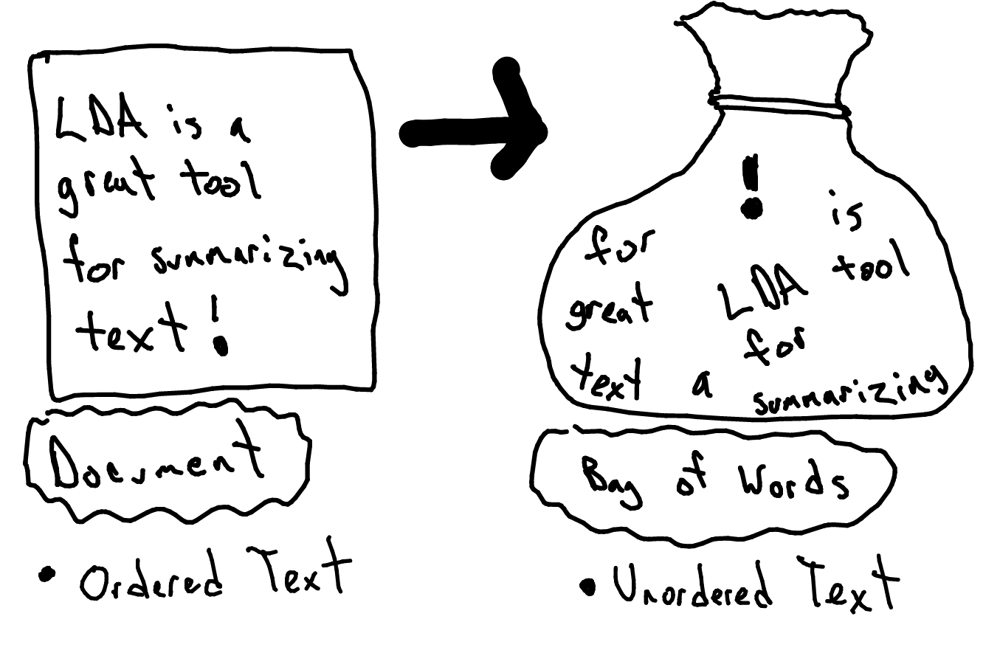

# Word Representations

This chapter offers a general overview of how documents and words are viewed and processed during topic modeling. 

## Bag of Words
LDA processes documents as a 'bag of words'. Bag of words means you view the frequency of the words in a document with no regard for the order the words appeared in. 

```{r BagOfWords, echo = FALSE, fig.cap = 'Bag of Words Representation'}

```

Obviously there is going to be some information lost in this process, but our goal with topic modeling is to be able to view the 'big picture' from a large number of documents. Alternate way of thinking about it:  I have a vocabulary of 100k words used across 1 million documents, then I use LDA to look 500 topics. I just narrowed down my feature space from 100k features to 500 features (dimensionality reduction). 

Possible examples: 
Scrabble in reverse


## Document Term Matrix
The primary reason is that we need a way of summarizing text in a manner that we can process easily with a computer (or with math in general). One of the simplest ways to do this is by taking word counts for each individual word in a document. Each row is a unique word in the vocabulary and each column is a document. 


-------image----------
-------placeholder-------

